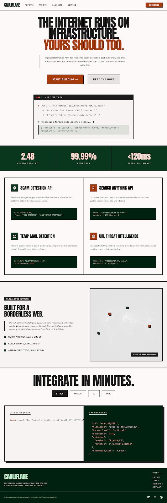

<div align="center">
  <h1>CAULIFLARE</h1>
  <p><strong>Infrastructure APIs for scam detection, search intelligence, and developer security.</strong></p>
  <p><em>Built for developers.</em></p>

  
  
  
</div>

<br />

<div align="center">
  
</div>

<br />

## ⚡ Cauliflare

Cauliflare provides fast and scalable APIs for:
- Scam detection
- URL threat analysis
- Temporary email detection
- Search intelligence
- AI moderation

Designed for developers building modern internet applications.

---

## 🚀 Features

- **Scam Detection API**
- **URL Threat Scanner**
- **Temp Mail Detection**
- **Spam Analysis**
- **Search Intelligence**
- **Fast REST API**
- **Developer-first SDKs**
- **Real-time responses**

---

## 📦 Installation

To run the Cauliflare web app locally:

```bash
git clone https://github.com/techxsarwar/cauliflare.git
cd cauliflare
```

**Frontend:**
```bash
cd frontend
npm install
npm run dev
```

**Backend:**
```bash
cd backend
go run .
```

---

## ⚡ Quick Start

```javascript
const response = await fetch("https://api.cauliflare.in/scan-url", {
  method: "POST",
  headers: {
    "Authorization": "Bearer YOUR_API_KEY",
    "Content-Type": "application/json"
  },
  body: JSON.stringify({
    url: "http://suspicious-site.com"
  })
})

const data = await response.json()
console.log(data)
```

---

## 📄 Response Example

```json
{
  "safe": false,
  "risk_score": 94,
  "phishing": true,
  "reasons": [
    "Suspicious domain age",
    "Known phishing pattern"
  ]
}
```

---

## 📡 API Endpoints

| Endpoint | Description |
|----------|-------------|
| `POST /scan-url` | Analyze suspicious URLs |
| `POST /check-email` | Detect temp emails |
| `POST /detect-scam` | Analyze scam text |
| `GET /search` | Search intelligence API |

---

## ❓ Why Cauliflare?

Modern applications face:
- scams
- spam
- phishing
- fake users
- malicious links

**Cauliflare helps developers integrate protection into their apps in minutes.**

---

## 🏗 Architecture

Cauliflare uses:
- Go (Golang) HTTP Service
- PostgreSQL
- Redis
- Meilisearch
- AI-based threat scoring

---

## 🗺 Roadmap

- [x] URL Scanner
- [x] Temp Mail Detection
- [ ] AI Moderation
- [ ] Telegram Threat Search
- [ ] Browser Extension
- [ ] SDKs
- [ ] Dashboard

---

## 🤝 Contributing

Contributions are welcome.

Fork the repository and submit a pull request.

---

## 📜 License

MIT License

<br />

> **Cauliflare aims to become the infrastructure layer developers rely on for internet trust and intelligence.**
