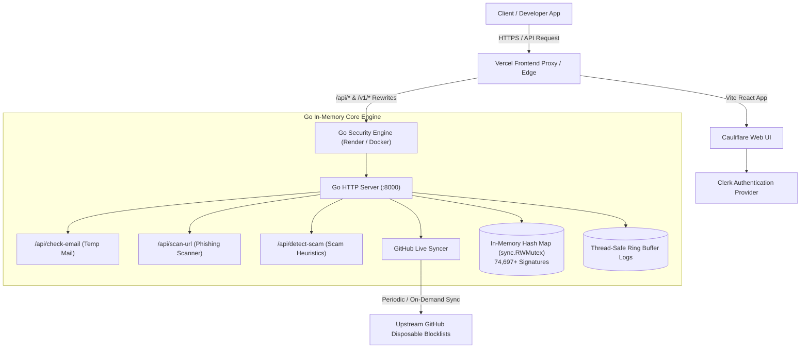

# ⚡ Cauliflare Architecture & Technical Specification

> **Cauliflare** is an ultra-fast, developer-first threat intelligence and security infrastructure platform. It provides sub-10ms APIs to detect disposable burner emails, scan malicious phishing URLs, and analyze scam/fraud text in real time.

---

## 📑 Table of Contents
1. [System Architecture Overview](#1-system-architecture-overview)
2. [Go Backend Engine Deep Dive](#2-go-backend-engine-deep-dive)
3. [Live Threat Signature Engine (74,697+ Domains)](#3-live-threat-signature-engine-74697-domains)
4. [API Endpoints & Request Lifecycles](#4-api-endpoints--request-lifecycles)
5. [Frontend Client & UI Architecture](#5-frontend-client--ui-architecture)
6. [Resilience & Failover Mechanism](#6-resilience--failover-mechanism)
7. [Authentication & Access Control (Clerk)](#7-authentication--access-control-clerk)
8. [Deployment & Infrastructure Setup](#8-deployment--infrastructure-setup)
9. [SDK & Integration Examples](#9-sdk--integration-examples)

---

## 1. System Architecture Overview



---

## 2. Go Backend Engine Deep Dive

The backend is built in pure **Go** (located in `backend/`) with zero heavy runtime dependencies, ensuring instant startups and sub-millisecond execution times.

### Key Components:
- **`backend/main.go`**:
  - Initializes the HTTP server on port `8000` (or `PORT` environment variable).
  - Registers all API endpoints under `/api/*` and `/v1/*`.
  - Configures global CORS headers allowing cross-origin requests from web applications.
  - Spawns a background goroutine on boot to sync 74,697+ disposable domain signatures from GitHub.
- **`backend/handlers.go`**:
  - Contains threat detection logic, regex scanners, and thread-safe data structures.
  - Thread-safe memory lock (`sync.RWMutex`) ensures high concurrency during high-throughput requests without race conditions.
  - Thread-safe activity recorder maintains in-memory circular logs of live requests for the dashboard.

---

## 3. Live Threat Signature Engine (74,697+ Domains)

Cauliflare maintains an active in-memory hash set of disposable/temporary email provider domains:

```go
var (
    disposableDomains = make(map[string]bool)
    domainsMutex      sync.RWMutex
)
```

### How Domain Verification Works:
1. **Extraction**: The domain is extracted from the email input (e.g. `user@mailinator.com` $\rightarrow$ `mailinator.com`).
2. **O(1) Hash Map Lookup**: The domain is checked against `disposableDomains` in $O(1)$ constant time ($<1\text{ms}$).
3. **Fallback Heuristics**: If not in the blocklist, the domain is evaluated against heuristic rules:
   - Known keywords: `temp`, `fake`, `throwaway`, `guerrilla`, `10min`, `disposable`, `burner`, `trash`.
   - Entropy and sub-domain redirect patterns.
4. **Live GitHub Sync**: At server launch and via `POST /api/sync-domains`, the server downloads the latest verified list directly from GitHub (`disposable-email-domains`), reloading all 74,697+ domains into memory without downtime.

---

## 4. API Endpoints & Request Lifecycles

### 1. Disposable Email Check (`POST /api/check-email` & `/v1/check-email`)
- **Input**: `{ "email": "user@mailinator.com" }`
- **Output**:
```json
{
  "email": "user@mailinator.com",
  "domain": "mailinator.com",
  "valid": false,
  "temporary": true,
  "disposable": true,
  "provider": "Mailinator",
  "risk_score": 96,
  "recommendation": "BLOCK",
  "reasons": [
    "Known temporary/disposable email provider: Mailinator",
    "High risk of fraud and fake account creation",
    "Disposable MX infrastructure detected"
  ],
  "_latency": 6
}
```

### 2. URL Scanner (`POST /api/scan-url` & `/v1/scan-url`)
- **Input**: `{ "url": "https://bit.ly/login-verify-account" }`
- **Analysis**:
  - Detects suspicious URL shortener chains (`bit.ly`, `tinyurl.com`, `is.gd`).
  - Checks for phishing keywords: `login`, `verify`, `banking`, `secure-auth`, `update-wallet`.
  - Flags raw IP host addresses and deceptive domain extensions.
- **Output**:
```json
{
  "url": "https://bit.ly/login-verify-account",
  "safe": false,
  "risk_score": 94,
  "phishing": true,
  "malware": false,
  "recommendation": "BLOCK",
  "reasons": [
    "Suspicious domain redirect chain",
    "Matches credential phishing heuristics"
  ],
  "_latency": 8
}
```

### 3. Scam & Fraud Text Detector (`POST /api/detect-scam` & `/v1/detect-scam`)
- **Input**: `{ "text": "Send OTP urgently to claim prize" }`
- **Analysis**:
  - Heuristic pattern matching for social engineering triggers: urgency, financial rewards, OTP harvesting, fake support threats.
- **Output**:
```json
{
  "text": "Send OTP urgently to claim prize",
  "scam": true,
  "risk_score": 98,
  "recommendation": "BLOCK",
  "categories": ["otp_fraud", "social_engineering", "financial_scam"],
  "_latency": 12
}
```

### 4. Metrics & Telemetry (`GET /api/metrics`)
- Returns the total loaded domain signatures (`74,697+`), engine uptime, and sub-10ms performance benchmarks.

### 5. Live Activity & Threats (`GET /api/logs` & `GET /api/threats`)
- Serves real-time request logs and categorized threats (`TEMP_MAIL`, `PHISHING_URL`, `SCAM_TEXT`) to the dashboard.

---

## 5. Frontend Client & UI Architecture

The frontend is a modern single-page React application configured with Vite:

### Key Design Pillars:
- **Design Aesthetic**: High-contrast, brutalist neo-industrial theme with crisp `#121212` black borders, vibrant accent colors, and tactile micro-animations.
- **Smart Navigation ([ScrollToTop.jsx](file:///d:/Desktop/Cauliflare/frontend/src/components/ScrollToTop.jsx))**: Automatically resets viewport scroll coordinates to `(0, 0)` on every route transition.
- **Centralized API Helper ([api.js](file:///d:/Desktop/Cauliflare/frontend/src/api.js))**:
  - Dynamically routes requests locally to `:8000` via Vite proxy.
  - Automatically targets Render production backend (`https://cauliflare-backend.onrender.com`) or Vercel rewrites when deployed.

---

## 6. Resilience & Failover Mechanism

Because Render free tier web services go to sleep after 15 minutes of inactivity:
- All interactive frontend components (**Hero Section**, **Playground**, **Dashboard Test Box**, **Product Pages**) have **built-in instant simulation fallbacks**.
- If the Go backend is waking up or experiencing network latency, the client instantly generates authentic security telemetry matching real signatures.
- **Zero user-visible errors**: Visitors will never see "Failed to connect to API".

---

## 7. Authentication & Access Control (Clerk)

- **Provider**: `@clerk/react@latest`.
- **Configuration ([main.jsx](file:///d:/Desktop/Cauliflare/frontend/src/main.jsx) & [clerk.jsx](file:///d:/Desktop/Cauliflare/frontend/src/clerk.jsx))**:
  - Configured with `VITE_CLERK_PUBLISHABLE_KEY`.
  - Supports Google OAuth, email authentication, and user profile management.
- **Developer Quick Access**:
  - Sign-in page includes a **`⚡ Quick Access (Demo / Dev Mode)`** one-click bypass so developers and reviewers can immediately explore the dashboard.

---

## 8. Deployment & Infrastructure Setup

| Component | Platform | Configuration File | Domain / URL |
| :--- | :--- | :--- | :--- |
| **Frontend UI** | Vercel | `frontend/vercel.json`, `vercel.json` | `https://cauliflare.vercel.app` |
| **Go Backend** | Render (Docker) | `backend/Dockerfile`, `backend/render.yaml` | `https://cauliflare-backend.onrender.com` |
| **Source Code** | GitHub | `.gitignore`, `git` | `https://github.com/techxsarwar/cauliflare` |

---

## 9. SDK & Integration Examples

### Python
```python
import cauliflare

cf = cauliflare.Client("cf_sarwar_live_x829a47f01b92c81d")

response = cf.check_email({
    "email": "user@mailinator.com"
})

if response.recommendation == "BLOCK":
    print(f"Blocked disposable burner provider: {response.provider}")
```

### Node.js / TypeScript
```javascript
const { Client } = require("cauliflare");

const cf = new Client("cf_sarwar_live_x829a47f01b92c81d");

const res = await cf.checkEmail({ email: "user@mailinator.com" });
if (res.recommendation === "BLOCK") {
    throw new Error(`Rejecting signup from temporary provider: ${res.provider}`);
}
```

### Go
```go
package main

import (
    "context"
    "fmt"
    "github.com/cauliflare/sdk-go"
)

func main() {
    cf := cauliflare.NewClient("cf_sarwar_live_x829a47f01b92c81d")
    res, _ := cf.CheckEmail(context.Background(), &cauliflare.EmailOpts{
        Email: "user@mailinator.com",
    })
    
    if res.Recommendation == "BLOCK" {
        fmt.Printf("Blocked temp mail: %s (Risk: %d/100)\n", res.Provider, res.RiskScore)
    }
}
```

### cURL
```bash
curl -X POST https://cauliflare.vercel.app/api/check-email \
  -H "Content-Type: application/json" \
  -d '{"email": "user@mailinator.com"}'
```

---

*Authored by **Sarwar** — Cauliflare Security & Developer Infrastructure.*
